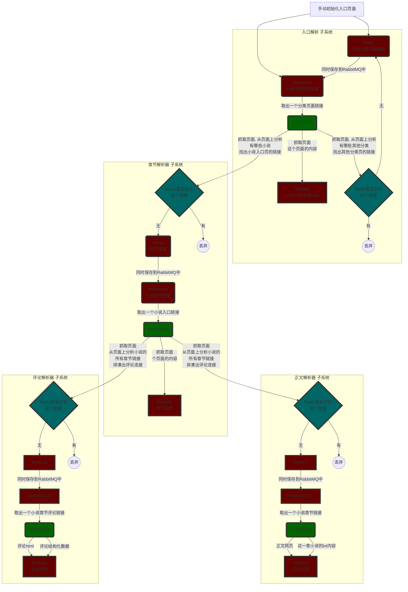

# qidian-spyder
尝试爬取起点中文网的所有小说，纯技术方案。目标是能够100%爬取起点的小说

# 问题
- 刚进来就发现一个起步就很困难的问题：所有起点的分页，全部被限制到5页以内了。。。
   - 针对这个问题，初步的想法是尽量细化各种分类搜索的条件
- VIP章节无法抓取，只能抓取前一小段
- 但发现另一个问题，所有的评论都是可以抓下来的。

# 初步方案
1. 从这个网站上开始：https://www.qidian.com/all/

然后可以发现，上面有非常多的分类：

  - 男女： 男生： https://www.qidian.com/all/， 女生： https://www.qidian.com/<B>mm</B>/all/
  - 分类：
    - 玄幻： https://www.qidian.com/all/<B>chanId21</B>/
      - 玄幻下一级分类，东方玄幻：https://www.qidian.com/all/chanId21<B>-subCateId8</B>/
    - 奇幻： https://www.qidian.com/all/chanId1/
  - 状态：
    - 连载：https://www.qidian.com/all/action0/，完本：https://www.qidian.com/all/action1/

以上多个条件混合的时候，除了男女这个选项外，其他选项全部在最后那个参数上用减号隔开。
如：男，东方玄幻，连载： https://www.qidian.com/all/chanId21-subCateId8-action0/

经过分析，以上内容回头先人工抓取下来，作为入口地址。

# 系统架构
- Redis: 放所有爬过的链接，用以快速判断，这个链接是否已经爬过，如果爬过，就不放到RabbitMQ里了，如果没爬过才放到RabbitMQ里，提高效率，防止重复爬取；
- RabbitMQ: 有多个不同的队列：
  - 各种页面，可以从这些页面上爬到小说入口
  - 小说入口，可以爬到这个小说的所有章节
  - 具体章节页面，可以爬到小说内容
  - 根据某个小说的章节，可以爬到相对应的评论
- RDBMS：存两方面内容
  - 小说相关
    - 小说的具体内容，包括小说的标题、作者等基本信息，以及小说的不同章节的纯文本内容；
    - 小说的评论相关内容
  - 爬取的内容相关
    - 所有爬取的网页，都需要hardcopy存到本地一份；
- 入口解析器: 从杂乱无章的页面上，分析出小说的入口页面链接
- 章节解析器: 从小说入口页面，分析出小说的章节页面链接
- 内容解析器: 从小说的章节页面链接，解析出小说正文内容
- 评论解析器: 根据小说的章节页面链接，拼凑出的评论页面，解析出评论内容

